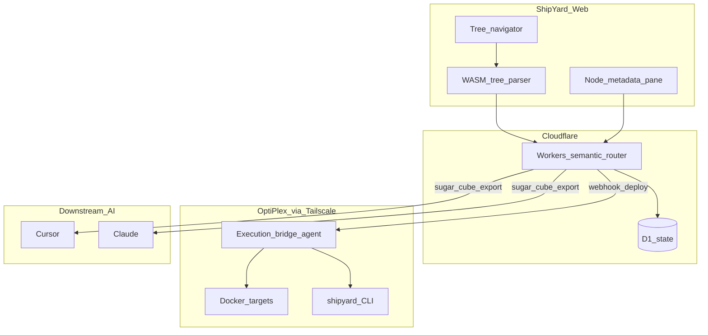

# Blueprint — Active Orchestration Node

## Overview

Transform **ShipYard Web** from a static project index into an **operational state machine**: WASM-assisted tree parsing, D1/Workers as semantic router, local execution bridge over Tailscale, and Sugar Cube export for AI handoff.

Production MVP: https://shipyard-web.shaneturon3.workers.dev/

## System architecture

### Frontend (ShipYard Web)

- Interactive **tree navigator**; node clicks query structural density (Pareto alignment).
- **HTMX + Vanilla JS** with **WASM parser** for real-time metadata streaming to D1.
- SSE or polling for deployment log visibility.

### Orchestration layer (Cloudflare Workers)

- **State router** between UI events and local bridge.
- **REST handoff**: authenticated deploy webhooks pass instruction schemas (Docker targets, networking) to local node.
- Optional **Hyperdrive** later for external DB reads — not required for v2 MVP.

### Execution bridge (local node)

- Python/Bash agent on workstation (OptiPlex), reachable via **Tailscale**.
- Polls D1/deployment queue or receives signed webhooks; spins Docker containers per instruction schema.
- Does not replace `shipyard refurbish` / sync apply gates.

### Sugar Cube engine

- Aggregates workspace mutations and directory annotations into JSON/YAML payload for AI consumption.
- Export endpoint: `GET /api/sugar-cube/:slug/export`.

## D1 schema (v2)

See `~/ShipYard/web/schema/002_orchestration.sql`:

- `project_workspaces` — before/target state JSON
- `tree_nodes` — path, tag, density score
- `deployment_events` — status machine + log tail
- `sugar_cubes` — exported bundle metadata

## Security

- Cloudflare Access on orchestration routes in production
- Webhook HMAC or Tailscale mesh — no open deploy endpoints
- No secrets in client or D1 rows

## Roadmap

| Step | Deliverable |
|------|-------------|
| 1 | D1 schema 002 + migration |
| 2 | WASM parser integration in frontend |
| 3 | Local execution bridge agent on OptiPlex |
