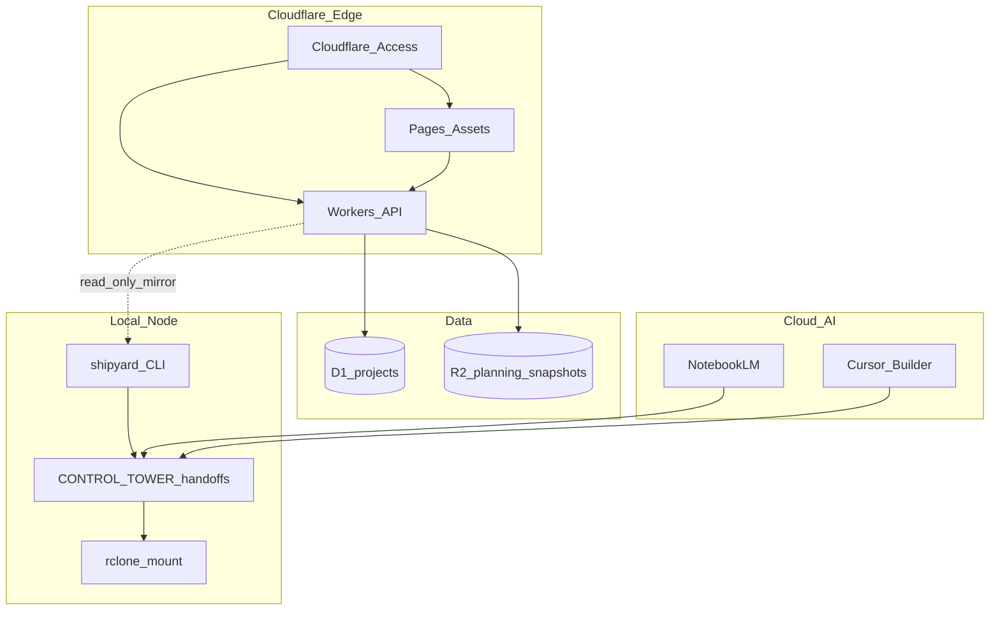

# Blueprint — ShipYard Web (Cloudflare)

## Overview

Evolve ShipYard from a localized Python CLI into a **Cloudflare-native web application** while preserving tri-phase discipline and the Architect → Builder handoff model. Phase 1 MVP is a **read-only dashboard** over D1; later phases add scaffold triggers, R2 planning snapshots, and audit APIs.

## System architecture

### Components

| Component | Technology | Responsibility |
|-----------|------------|----------------|
| Frontend | Cloudflare Pages (`public/`) | Project list, status badges, new-project form (Phase 2) |
| API | Cloudflare Workers (`src/worker.ts`) | REST JSON under `/api/*` |
| Metadata | D1 | Projects index, audit feedback |
| Artifacts | R2 | Optional cached `planning/` for `/api/audit/:slug` |
| Local CLI | Python ShipYard | Scaffold, refurbish, sync validation |
| Transport | Google Drive / rclone | Canonical handoff sync |

### Data flow

1. Operator seeds D1 from `PROJECT_INDEX` (or sync job).
2. Dashboard `GET /api/projects` reads D1.
3. `POST /api/new` inserts **pending** row + returns `shipyard new "..."` command for local execution (no remote shell).
4. External AI calls `GET /api/audit/:slug` → R2 or stub JSON with handoff paths.
5. `shipyard list` remains CLI-canonical; web reflects D1 mirror updated by seed/sync.

### External integrations

- **CONTROL TOWER** — handoff folder layout unchanged
- **ShipYard CLI** — command strings generated by API, executed locally
- **Google Drive** — source of truth for markdown handoffs
- **Cloudflare Access** — perimeter for dashboard and API

## Modules

| Module | Location | Notes |
|--------|----------|-------|
| `router` | `src/worker.ts` | Path routing |
| `projects` | `src/worker.ts` | CRUD read + create pending |
| `audit` | `src/worker.ts` | R2 get / placeholder |
| `dashboard` | `public/index.html` | HTMX loads `/api/projects` |

## Data model (D1)

See `schema/001_init.sql`.

## Non-functional requirements

| Area | Requirement |
|------|-------------|
| Performance | API p95 &lt; 200ms at edge for list endpoint |
| Security | No secrets in client; Access on production |
| Scalability | D1 sufficient for &lt;100 slugs |
| Observability | `wrangler tail` for Worker logs |

## Tech decisions

| Decision | Rationale |
|----------|-----------|
| Workers + static assets | Single `wrangler.jsonc`, simple MVP |
| D1 for index | Relational queries, edge-native |
| R2 for planning files | Large markdown blobs, AI read path |
| HTMX over SPA framework | Minimal JS, fast dashboard |
| CLI compatibility | Web does not replace `shipyard`; generates commands |

## Security

- Cloudflare Access in production
- CORS limited to Pages origin
- No `~/.machine_env` or rclone config in Worker
